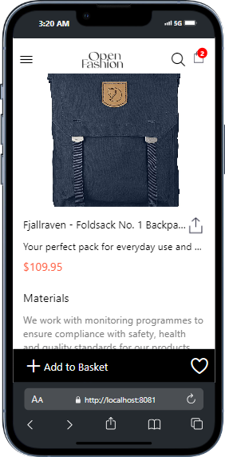
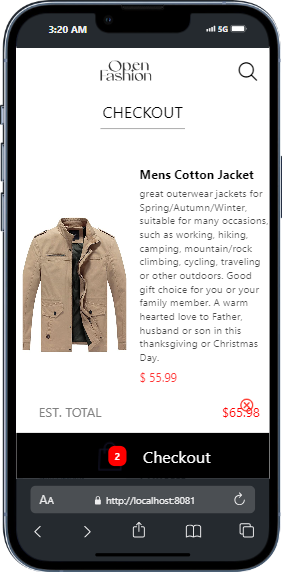

# rn-assignment7-11285447

# MarkApp

MarkApp is a React Native application that showcases a simple e-commerce functionality, including viewing product lists, product details, and managing a shopping cart. The app fetches product data from an external API and uses local storage to persist cart items.

## Features

- **HomeScreen**: Displays a list of available products fetched from an external API.
- **ProductDetailScreen**: Shows detailed information about a selected product.
- **CartScreen**: Displays items added to the cart with options to remove them.
- **Drawer Navigation**: Accessible through a swipe gesture or button, allowing navigation between Home, Product Detail, and Cart screens.
- **Add to Cart**: Button on each product to add it to the cart.
- **Remove from Cart**: Button to remove items from the cart.
- **Local Storage**: Uses AsyncStorage to store selected items locally on the device.
- **Data Fetching**: Uses Axios to fetch data from an external API.
- **Asynchronous Operations**: Managed with async/await for smooth data fetching and storage operations.

## Installation

1. **Clone the repository**:
   git clone https://github.com/Marks-Spencer20/rn-assignment7-11285447.git
   cd MarkApp
   

2. **Install dependencies**:
   npm install

3. **Start the application**:
   - For Android:
     npx react-native run-android
     
   - For iOS:
     npx react-native run-ios
     

## Project Structure

MarkApp
├── App.js
├── assets
│   ├── add_circle.png
│   ├── door.png
│   ├── Product.png
│   └── SideMenu.png
├── babel.config.js
├── package.json
├── package-lock.json
├── screens
│   ├── CheckoutScreen.jsx
│   ├── HomeScreen.js
│   └── ProductDetailScreen.jsx
├── components
│   ├── CheckoutProduct.jsx
│   ├── Header.js
│   ├── Product.jsx
│   └── SideMenu.js
├── context
│   └── CartContext.jsx
└── README.md

## Screens Overview

### HomeScreen

Displays a list of products fetched from the API. Each product has an "Add to Cart" button.

### ProductDetailScreen

Shows detailed information about a selected product, including an "Add to Cart" button.

### CartScreen

Displays items added to the cart with an option to remove each item.

## Usage

- **View Products**: Launch the app to see a list of available products on the HomeScreen.
- **View Product Details**: Tap on a product to view its detailed information on the ProductDetailScreen.
- **Add to Cart**: Press the "Add to Cart" button on either the HomeScreen or ProductDetailScreen to add a product to the cart.
- **View Cart**: Navigate to the CartScreen using the drawer to see all added items and remove any if needed.

## External Libraries

- **React Navigation**: For navigation and drawer components.
- **Axios**: For fetching data from the external API.
- **AsyncStorage**: For storing cart items locally.
- **React Native Reanimated**: For enhanced animations.

## Acknowledgments

- [Fake Store API](https://fakestoreapi.com/) for providing sample product data.
